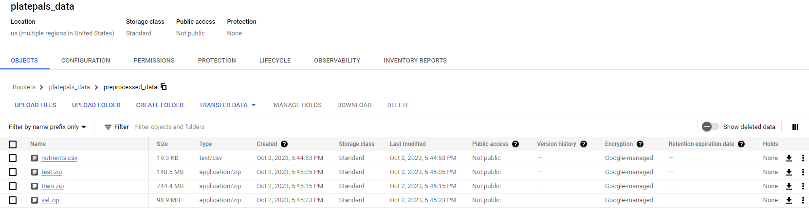
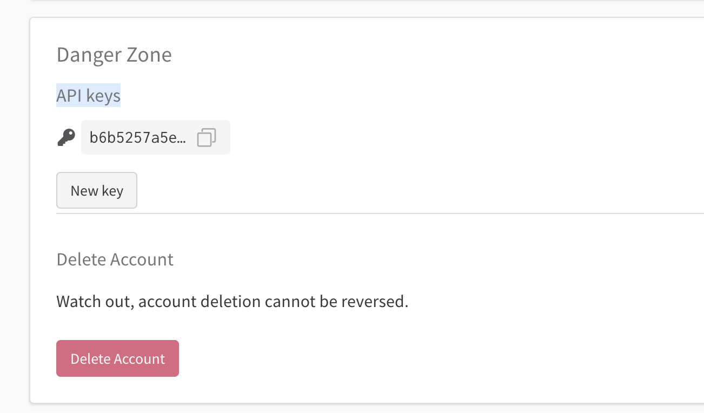
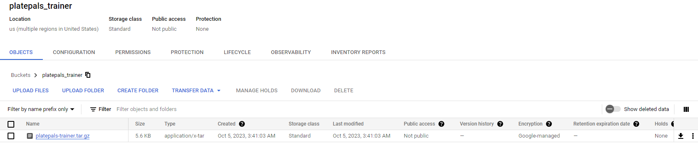
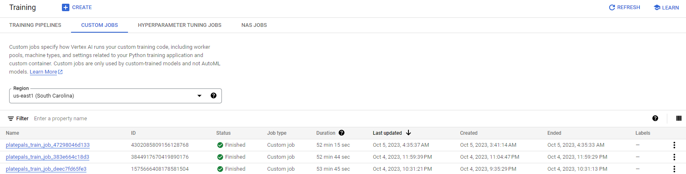
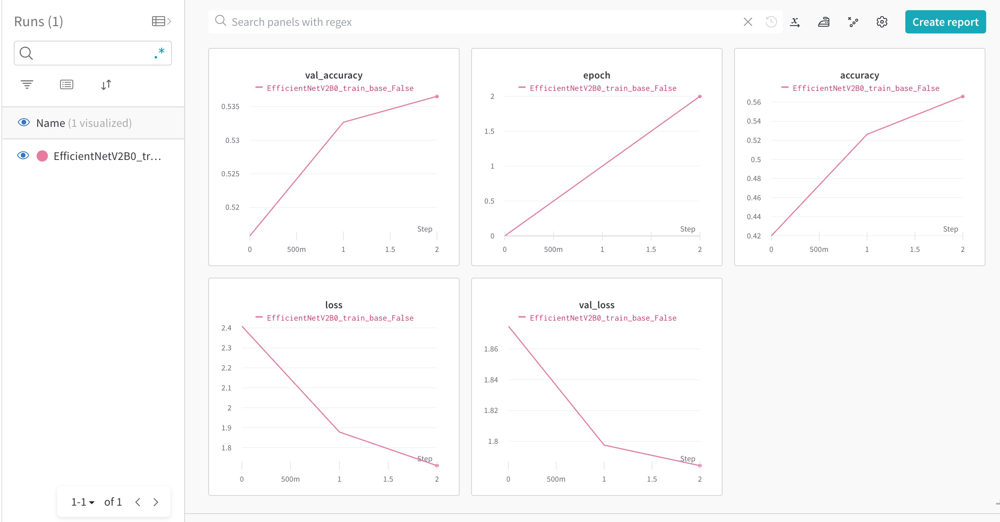
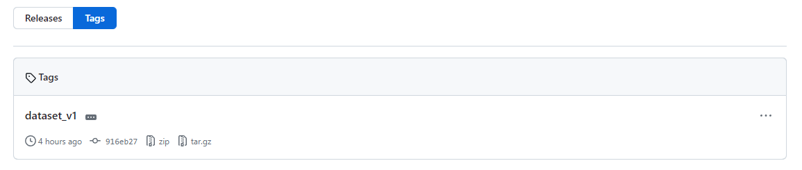

AC215 - Milestone 3 (PlatePals)
==============================
### Team Members ###

- Amelia Li
- Rebecca Qiu
- Peter Wu

### Group Name ###

PlatePals

### Project Description ###

The goal of this project is to develop a machine learning application that accurately identifies the types of food present in a user-uploaded image. Based on the foods identified, the application will provide the user with relevant nutritional information and personalized dietary recommendations. This project will involve key phases of data preprocessing, model development, and application interface development, leveraging TensorFlow's Food-101 dataset.

We'll predominantly employ TensorFlow's Food-101 dataset, featuring 101,000 annotated food images across 101 categories. Additionally, we will correlate the identified food items with nutritional metrics obtained from Kaggle's Nutrition datasets and a database called Nutritional Facts for Most Common Foods, which together offer around 9,000 nutritional records. Our dataset is securely hosted in a private Google Cloud Bucket.

**Recap of Milestone 2**

In milestone 2, we provide a container that pulls data from the TensorFlow [Food-101 dataset](https://www.tensorflow.org/datasets/catalog/food101), performs train-validation-test split of 75%, 10%, and 15% respsectively, and uploads the files onto our remote GCS bucket as zip files. 

**Milestone 3**

In this milestone, we provide a container to read our training, validation, and testing dataset from our remote GCS bucket, fit a CNN model to called EfficientNetV2B0 through a custom job sent to [GCP Vertex AI](https://console.cloud.google.com/vertex-ai/training/custom-jobs) and model dashboard set up through [Weights and Biases](https://wandb.ai/).

Project Organization
------------
      ├── LICENSE
      ├── README.md
      ├── notebooks
      ├── references
      ├── requirements.txt
      ├── setup.py
      ├── reports
      └── src
            |── model-training
                ├── cli-multi-gpu.sh
                ├── cli.py
                ├── cli.sh
                ├── docker-entrypoint.sh
                ├── docker-shell.bat
                ├── docker-shell.sh
                ├── Dockerfile
                ├── package-trainer.sh
                ├── Pipfile
                ├── Pipfile.lock
                └── package
                    ├── PKG-INFO
                    ├── setup.cfg
                    ├── setup.py
                    └── trainer
                        ├── __init__.py
                        ├── task_multi_gpu.py
                        └── task.py
            |── preprocessing
                ├── Dockerfile
                ├── docker-entrypoint.sh
                ├── docker-shell.bat
                ├── docker-shell.sh
                ├── preprocess.py
                └── requirements.txt
                
Preprocess container (Milestone 2)
------------
- This container ingests 4.65GB of the [Food-101 dataset](https://www.tensorflow.org/datasets/catalog/food101) and performs image preprocessing before uploading the modified data to a GCS Bucket.
- It also fetches and uploads [nutritional data](https://raw.githubusercontent.com/prasertcbs/basic-dataset/master/nutrients.csv) as a CSV file to the same GCS Bucket.
- Required inputs: GCS Project Name and GCS Bucket Name.
- Output: Processed data stored in the GCS Bucket.

(1) `src/preprocessing/preprocess.py`: This file manages the preprocessing of our 4.65GB dataset. Image dimensions are resized to 128x128 pixels to expedite subsequent processing. We apply random transformations such as horizontal flips, rotations, and zooms. These preprocessed images are batch-processed and uploaded to the GCS Bucket as a zip file.

(2) `src/preprocessing/requirements.txt`: Lists the Python packages essential for image preprocessing.

(3) `src/preprocessing/Dockerfile`: The Dockerfile is configured to use `python:3.9-slim-buster`. It sets up volumes and uses secret keys (which should not be uploaded to GitHub) for connecting to the GCS Bucket.

Model Training a Multi-Class CNN Model (Milestone 3)
------------
- This container reads 4.65GB of the [Food-101 dataset](https://www.tensorflow.org/datasets/catalog/food101) from a GCS Bucket that we populated in the `Preprocess container` section.
- It fits and tests EfficientNetV2B0, a CNN model, using the train-val-test split we created in in the `Preprocess container` section to our problem of classifying food images into the 101 labels. 
- The code to perform the the tasks is written in `task.py`.
- The code is sent to GCP Vertex AI to run.
- Our model is connected to Weights and Biases, so we are able to view the model's performance and metrics at every epoch in its training and testing.
- Required inputs: GCS Project Name, GCS Bucket Name (data), GCS Bucket Name (model code), and WandB key.
- Output: Model output in Weights and Biases and Vertex AI

(1) `src/model-training/package/trainer/task.py`: This file reads our food data, a 4.65GB dataset, from the GCS bucket, fits a CNN model for multi-class classification, and then evaluates in on a test dataset. Image dimensions are resized to 128x128 pixels.

Running our code
------------
### Milestone 2 (preprocessing container) ###

**Setup GCP Service Account**
1. Create a secrets folder that is on the same level as the project folder.
2. Head to [GCP Console](https://console.cloud.google.com/home/dashboard).
3. Search for "Service Accounts" from the top search box OR go to: "IAM & Admins" > "Service Accounts" and create a new service account called "PlatePals". 
4. For "Grant this service account access to project", select "Cloud Storage" > "Storage Object Viewer"
5. Click done. This will create a service account.
6. Click on the "..." under the "Actions" column and select "Manage keys".
7. Click on "ADD KEY" > "Create new key" with "Key type" as JSON.
8. Copy this JSON file into the secrets folder created in step 1 and rename it as "data-service-account.json".

**Setup GCS Bucket (data bucket)**
1. Head to [GCP Console](https://console.cloud.google.com/home/dashboard).
2. Search for "Buckets" from the top search box OR go to: "Cloud Storage" > "Buckets" and create a new bucket with an appropriate bucket name e.g. "platepals-data".
3. Click done. This will create a new GCS Bucket (GCS_BUCKET_NAME) for the container to upload your preprocessed data.

**Set GCP Credentials**
1. Head to `src/preprocessing/docker-shell.sh`.
2. Replace `GCS_BUCKET_NAME` and `GCP_PROJECT` with corresponding GCS Bucket Name that you have chosen above and GCP Project Name.
3. (If you have a M1 Mac) Use the line that contains `--platform=linux/arm64/v8` to build your docker image.

**Execute Dockerfile**
1. Make sure the Doker application is operational.
2. **NOTE: EXECUTION MAY TAKE 2-3 HOURS DEPENDING ON NETWORK SPEED.** Navigate to src/preprocessing and execute `sh docker-shell.sh`.
3. Upon completion, your GCS Bucket should display the processed data as shown under the default folder name "preprocessed_data" (you can change this in preprocess.py).


### Milestone 3 (model-training container) ###

This milestone assumes that you have done the steps mentioned for milestone 2 (preprocessing container).

**Setup GCS Bucket (trainer bucket)**
1. Head to [GCP Console](https://console.cloud.google.com/home/dashboard).
2. Search for "Buckets" from the top search box OR go to: "Cloud Storage" > "Buckets" and create a new bucket with an appropriate bucket name e.g. "platepals-trainer".
3. Click done. This will create a new GCS Bucket (GCS_BUCKET_URI) for the container to uplaod the code used to train the model.

**Set GCP Credentials**
1. Head to `src/model-training/docker-shell.sh`.
2. Replace `GCS_BUCKET_URI` and `GCP_PROJECT` with corresponding GCS Bucket Name that you have chosen above and GCP Project Name.
3. (If you have a M1 Mac) Use the line that contains `--platform=linux/arm64/v8` to build your docker image.
3. (If you modified your default folder name for your data) Head to `src/model-training/package/trainer/task.py`.
4. Change the string assigned to `data_version`.

**Set Environment Variables**
1. Login to [Weights and Biases](https://wandb.ai/).
2. Go to [user settings](https://wandb.ai/settings).
3. Scroll down to the `API Keys` section.

4. Copy the key and set an environment variable using your terminal: `export WANDB_KEY=...`
5. Set another environment variable for your GCS data bucket (that contains your data): `export GCS_BUCKET_NAME=...`

**If you have access to Vertex AI GPU**
1. Head to `src/model-training/cli.sh`.
2. Uncomment the code under "Run training with GPU" and comment out the code under "Run training with no GPU".

**Execute Dockerfile**
1. Make sure the Docker application is operational.
2. Navigate to `src/model-training` and execute `sh docker-shell.sh`.
3. Once you are in the docker container, run `sh package-trainer.sh`.
4. You should be able to see that a `tar.gz` file has been uploaded to your GCS trainer bucket.

4. **NOTE: EXECUTION MAY TAKE 15 MINUTES TO 1 AN HOUR DEPENDING ON GPU/CPU.** Still inside the docker container, run `sh cli.sh`.
3. Upon completion, your custom job should populate in GCP Vertex AI and model dashboard should show up in Weights and Biases.


Results
------------
**Experiment Tracking**

Below you can see the output from our Weights & Biases page. We used this tool to track several iterations of our model training when it trained our EfficientNet. It was tracked using the `wandb` library we included inside of our `task.py` script. Below is a screenshot of one iteration that we performed with EfficientNetV2B0 for 3 epochs.



**Serverless Training**

Inside our training container, we sent our training job to GCP Vertex AI so it is trained on instances in the cloud, which was how we connected to the Weights & Biases in the previous image above. In the image below, you can see several runs of our model. We had a successful completion of the custom job.


DVC Setup
------------
This step is entirely optional.
1. Create a VM on Google Cloud Platform
2. Install Docker on the VM
```
# Add Docker's official GPG key:
sudo apt-get update
sudo apt-get install ca-certificates curl gnupg
sudo install -m 0755 -d /etc/apt/keyrings
curl -fsSL https://download.docker.com/linux/debian/gpg | sudo gpg --dearmor -o /etc/apt/keyrings/docker.gpg
sudo chmod a+r /etc/apt/keyrings/docker.gpg

# Add the repository to Apt sources:
echo \
  "deb [arch="$(dpkg --print-architecture)" signed-by=/etc/apt/keyrings/docker.gpg] https://download.docker.com/linux/debian \
  "$(. /etc/os-release && echo "$VERSION_CODENAME")" stable" | \
  sudo tee /etc/apt/sources.list.d/docker.list > /dev/null
sudo apt-get update

sudo apt-get install docker-ce docker-ce-cli containerd.io docker-buildx-plugin docker-compose-plugin -y

sudo docker run hello-world
```
3. Install git: `sudo apt-get install git`
4. Set up git SSH on the VM `ssh-keygen -t ed25519 -C "youremail@gmail.com"` (Press enter for all 3 questions)
5. Your public key is located in `cat /home/<name>/.ssh/id_ed25519.pub` (Copy contents of this file on to clipboard) 
5. Go to -> GitHub.com -> Settings (top right under your pfp) -> SSH and GPG keys (left) -> New SSH key -> give any title -> copy contents in key -> Add SSH Key (please login again when asked)
6. Copy following files from [https://github.com/ac2152023/dvcrepo](https://github.com/ac2152023/dvcrepo) to your private repo
```
Dockerfile
Pipfile
Pipfile.lock
docker-entrypoint.sh
docker-shell.sh
.gitignore
```
7. `git clone git@github.com:{USERNAME}/<privaterepo>.git`
8. Upload your secrets to secrets folder , check entries in docker-entrypoint.sh, docker-shell.sh
9. Run `sudo sh docker-shell.sh`
10. Run these commands in the docker container for DVC
```   
mkdir mushdvc
gcsfuse mushdvc mushdvc/
dvc init
dvc remote add -d mushdvc gs://mushdvc/dvc_store
dvc add mushdvc  
dvc push

git status
git add .
git commit -m 'dataset update 1'
git tag -a 'dataset_v1' -m 'tag dataset'
git push --atomic origin main dataset_v1
```
11. You should see the tagged dataset on your private repo.



Discussion Regarding Tools Used
------------
1. **Label Studio**: In our project, the image data is already pre-organized and labeled through a folder-based hierarchy, where each folder name serves as the label for the images contained within it. This structure effectively eliminates the need for a separate labeling tool like Label Studio. Therefore, we have opted not to incorporate Label Studio into our existing data pipeline.

2. **Dask**: In our project, the dataset size is well below the 5GB threshold where distributed computing frameworks like Dask would typically be beneficial.  In this context, the overhead of utilizing Dask outweighs the benefits, making it an overkill solution for our particular use case. Therefore, we have chosen not to integrate Dask into our project's data processing workflow

3. **Remote Data and DVC Integration**: In a previous milestone, we encountered difficulties in integrating DVC into our project due to our dataset being stored remotely in a GCS Bucket. Our initial challenges stemmed from the fact that the in-class examples were tailored for locally-stored data, making our remote setup a complicating factor. However, with the guidance and code provided by the course staff, we were able to successfully adapt the DVC workflow to accommodate our remote storage setup. 

4. **TF Data and TF Records**: Our project employs TensorFlow's tf.data and TFRecords as part of our data pipeline, specifically to facilitate efficient and scalable training of our image classification model based on EfficientNetV2B0. TFRecords offer a compact binary storage format, which is optimized for TensorFlow, allowing for rapid data loading. Coupled with the tf.data, it enables us to create highly performant input pipelines, thereby reducing I/O bottlenecks. By leveraging tf.data and TFRecords, we are able to ensure that the data feeding process doesn't become a bottleneck.

5. **EfficientNetV2B0**: EfficientNetV2B0 is an evolution of the original EfficientNet architecture, designed for both improved accuracy and computational efficiency in the context of image classification tasks. According to [this study](https://arxiv.org/abs/2104.00298), the EfficientNetV2 models train faster while being up to 6.8x smaller. These enhancements make EfficientNetV2B0 an attractive choice for our project, as it allows us to achieve state-of-the-art accuracy while also maintaining computational efficiency, a key factor given the resource constraints that are often present in real-world machine learning projects.