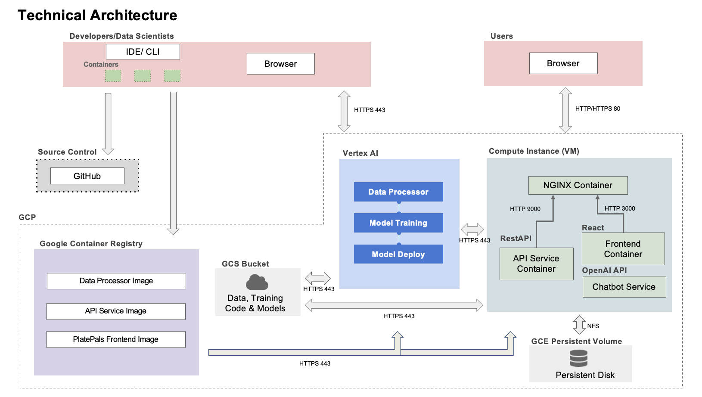

AC215 - Milestone 5 (PlatePals)
==============================
### Team Members ###

- Amelia Li
- Rebecca Qiu
- Peter Wu

### Group Name ###

PlatePals

### Project Description ###

The goal of this project is to develop a machine learning application that accurately identifies the types of food present in a user-uploaded image. Based on the foods identified, the application will provide the user with relevant nutritional information and personalized dietary recommendations. This project will involve key phases of data preprocessing, model development, and application interface development, leveraging TensorFlow's Food-101 dataset.

We'll predominantly employ TensorFlow's Food-101 dataset, featuring 101,000 annotated food images across 101 categories. Additionally, we will correlate the identified food items with nutritional metrics obtained from Kaggle's Nutrition datasets and a database called Nutritional Facts for Most Common Foods, which together offer around 9,000 nutritional records. Our dataset is securely hosted in a private Google Cloud Bucket.

**Recap of Milestone 2**

In milestone 2, we provide a container that pulls data from the TensorFlow [Food-101 dataset](https://www.tensorflow.org/datasets/catalog/food101), performs train-validation-test split of 75%, 10%, and 15% respsectively, and uploads the files onto our remote GCS bucket as zip files. 

**Recap of Milestone 3**

In this milestone, we provide a container to read our training, validation, and testing dataset from our remote GCS bucket, fit a CNN model to called EfficientNetV2B0 through a custom job sent to [GCP Vertex AI](https://console.cloud.google.com/vertex-ai/training/custom-jobs) and model dashboard set up through [Weights and Biases](https://wandb.ai/).

**Recap of Milestone 4**

In this milestone, we distilled our CNN model called EfficientNetV2B0 and provided performance benchmarks and analysis. Furthermore, we documented the successful integration of Vertex AI Pipelines (Kubeflow) for machine learning orchestration and cloud functions for process automation. Additionally, we have added docstrings and type hints to all of our Python functions.

**Milestone 5**

In this milestone, we are focused on advancing and deploying a user-centric application that integrates the elements established in the preceding milestone. The application's front-end is developed using React, and its deployment is managed through Google Cloud Platform (GCP) Virtual Machines and Ansible for streamlined orchestration and automation. Furthermore, we also added a ChatBot into our app allowing users to chat with an AI based on the food image they uploaded.

Project Organization
------------
      ├── LICENSE
      ├── README.md
      ├── notebooks
      ├── references
      ├── requirements.txt
      ├── setup.py
      ├── reports
      └── src
            |── api-service
                ├── api
                    ├── model.py
                    └── service.py
                ├── docker-entrypoint.sh
                ├── Dockerfile
                ├── docker-shell.sh
                ├── Pipfile
                └── Pipfile.lock
            |── frontend-react
                ├── conf
                    └── conf.d
                        └── default.conf
                ├── public
                    ├── index.html
                    └── manifest.json
                ├── src
                    ├── app
                        ├── App.css
                        ├── App.js
                        ├── AppRoute.js
                        └── Theme.js
                    ├── common
                        ├── Content
                            ├── index.js
                            └── style.js
                        ├── Footer
                            ├── index.js
                            └── style.js
                        └── Header
                            ├── index.js
                            └── style.js
                    ├── components
                        ├── ChatBot
                            ├── index.js
                            └── style.js
                        ├── Error
                            └── 404.js
                        ├── Home
                            ├── index.js
                            └── style.js
                        ├── ImageClassification
                            ├── index.js
                            └── style.js
                        └── TOC
                            ├── index.js
                            └── style.js
                    ├── services
                        ├── Common.js
                        └── DataService.js
                    ├── index.css
                    └── index.js
            |── deployment
                ├── deploy-create-instance.yml
                ├── deploy-docker-images.yml
                ├── deploy-provision-instance.yml
                ├── deploy-setup-containers.yml
                ├── deploy-setup-webserver.yml
                ├── inventory.yml
                ├── Dockerfile
                ├── docker-entrypoint.sh
                ├── docker-shell.sh
                └── nginx-conf
                    └── nginx
                        └── nginx.conf
            |── workflow
                ├── cli.py
                ├── model.py
                ├── data_processor.yaml
                ├── model_training.yaml
                ├── model_deploy.yaml
                ├── pipeline.yaml
                ├── Dockerfile
                ├── docker-entrypoint.sh
                ├── docker-shell.sh
                ├── Pipfile
                └── Pipfile.lock
            |── model-training
                ├── cli.py
                ├── docker-entrypoint.sh
                ├── docker-shell.sh
                ├── Dockerfile
                ├── package-trainer.sh
                ├── Pipfile
                ├── Pipfile.lock
                └── package
                    ├── PKG-INFO
                    ├── setup.cfg
                    ├── setup.py
                    └── trainer
                        ├── __init__.py
                        └── task.py
            └── preprocessing
                ├── Dockerfile
                ├── docker-entrypoint.sh
                ├── docker-shell.sh
                ├── cli.py
                ├── Pipfile
                └── Pipfile.lock
                                    
Preprocess container (Milestone 2)
------------
- This container ingests 4.65GB of the [Food-101 dataset](https://www.tensorflow.org/datasets/catalog/food101) and performs image preprocessing before uploading the modified data to a GCS Bucket.
- It also fetches and uploads [nutritional data](https://raw.githubusercontent.com/prasertcbs/basic-dataset/master/nutrients.csv) as a CSV file to the same GCS Bucket.
- Required inputs: GCS Project Name and GCS Bucket Name.
- Output: Processed data stored in the GCS Bucket.

(1) `src/preprocessing/preprocess.py`: This file manages the preprocessing of our 4.65GB dataset. Image dimensions are resized to 128x128 pixels to expedite subsequent processing. We apply random transformations such as horizontal flips, rotations, and zooms. These preprocessed images are batch-processed and uploaded to the GCS Bucket as a zip file.

(2) `src/preprocessing/requirements.txt`: Lists the Python packages essential for image preprocessing.

(3) `src/preprocessing/Dockerfile`: The Dockerfile is configured to use `python:3.9-slim-buster`. It sets up volumes and uses secret keys (which should not be uploaded to GitHub) for connecting to the GCS Bucket.

Model Training a Multi-Class CNN Model (Milestone 3)
------------
- This container reads 4.65GB of the [Food-101 dataset](https://www.tensorflow.org/datasets/catalog/food101) from a GCS Bucket that we populated in the `Preprocess container` section.
- It fits and tests EfficientNetV2B0, a CNN model, using the train-val-test split we created in in the `Preprocess container` section to our problem of classifying food images into the 101 labels. 
- The code to perform the the tasks is written in `task.py`.
- The code is sent to GCP Vertex AI to run.
- Our model is connected to Weights and Biases, so we are able to view the model's performance and metrics at every epoch in its training and testing.
- Required inputs: GCS Project Name, GCS Bucket Name (data), GCS Bucket Name (model code), and WandB key.
- Output: Model output in Weights and Biases and Vertex AI

(1) `src/model-training/package/trainer/task.py`: This file reads our food data, a 4.65GB dataset, from the GCS bucket, fits a CNN model for multi-class classification, and then evaluates in on a test dataset. Image dimensions are resized to 128x128 pixels.

Distilling our CNN Model and Integrating Kubeflow (Milestone 4)
------------
This milestone introduces two new containers. The first contains all our training scripts and the second includes our Vertex AI pipeline integration. The first container will use data from a GCP bucket, train, and then output model artifacts (saved model) to a GCP bucket. The inputs for the second container is the source bucket for our trained model and creates a workflow job on Vertex AI.

The `model` folder consists of two folders: `effnetv2b0` and `effnetv2b0-distilled`. The model that we have decided to use the EfficientNetV2B0 (go to "Discussion Regarding Tools Used" for explanation). This model is trained within the `effnetv2b0` folder. We have utilized the distillation compression method to train a student model that is smaller in size but can potentially achieve similar results as the teacher model (EfficientNetV2B0) and this is trained within the `effnetv2b0-distilled` folder.

(1) `src/model/effnetv2b0/package/effnetv2b0-trainer/task.py` - This script loads our preprocessed food TF dataset and fits the EfficientNet model.

(2) `src/model/effnetv2b0_distilled/package/effnetv2b0-distilled-trainer/task.py` - This script loads our preprocessed food TF dataset and fits the distilled EfficientNet model.

(3) `src/model/effnetv2b0/Dockerfile` - This dockerfile starts with `python:3.9-slim-buster`. This attaches volume to the docker container and also uses secrets  to connect to GCS.

For the `workflow` folder, running this script will create a container that will be used to build pipelines that run in Vertex AI. Pipelines can be orchestrated using Kubeflow Pipelines Python SDK (kfp). This container will have a CLI to submit the pipeline to Vertex AI in GCP.

(1) `src/workflow/cli.py` - The CLI to test creation and execution of pipelines.

(2) `src/workflow/pipeline.yaml` - The generated pipeline definition file.

(3) `src/workflow/Dockerfile` - This Dockerfile holds all the instruction to re-create an environemnt with all Google Cloud SDKs to enable us to connect with Vertext AI in GCP.

(4) `src/workflow/Pipfile` - Contains all the python dependencies required

Running our code
------------
### Enable APIs (make sure to have these APIs enabled on your GCP) ###
1. Cloud Resource Manager API
2. Vertex AI API
3. Compute Engine API
4. Service Usage API
5. Google Container Registry API
6. Kubernetes Engine API

### Milestone 2 (preprocessing container) ###

**Setup GCP Service Account**
1. Create a secrets folder that is on the same level as the project folder.
2. Head to [GCP Console](https://console.cloud.google.com/home/dashboard).
3. Search for "Service Accounts" from the top search box OR go to: "IAM & Admins" > "Service Accounts" and create a new service account called "PlatePals". 
4. For "Grant this service account access to project", select "Cloud Storage" > "Storage Object Viewer"
5. Click done. This will create a service account.
6. Click on the "..." under the "Actions" column and select "Manage keys".
7. Click on "ADD KEY" > "Create new key" with "Key type" as JSON.
8. Copy this JSON file into the secrets folder created in step 1 and rename it as "data-service-account.json".

**Setup GCS Bucket (data bucket)**
1. Head to [GCP Console](https://console.cloud.google.com/home/dashboard).
2. Search for "Buckets" from the top search box OR go to: "Cloud Storage" > "Buckets" and create a new bucket with an appropriate bucket name e.g. "platepals-data".
3. Under "Location type", select "Region" > "us-east1 (South Carolina)".
4. Click done. This will create a new GCS Bucket (GCS_BUCKET_NAME) for the container to upload your preprocessed data.

**Set GCP Credentials**
1. Head to `src/preprocessing/docker-shell.sh`.
2. Replace `GCS_BUCKET_NAME` and `GCP_PROJECT` with corresponding GCS Bucket Name that you have chosen above and GCP Project Name.
3. (If you have a M1 Mac) Use the line that contains `--platform=linux/arm64/v8` to build your docker image.

**Execute Dockerfile**
1. Make sure the Doker application is operational.
2. **NOTE: EXECUTION MAY TAKE 2-3 HOURS DEPENDING ON NETWORK SPEED.** Navigate to src/preprocessing and execute `sh docker-shell.sh`.
3. Upon completion, your GCS Bucket should display the processed data as shown under the default folder name "preprocessed_data" (you can change this in preprocess.py).


### Milestone 3 (model-training container) ###

This milestone assumes that you have done the steps mentioned for milestone 2 (preprocessing container).

**Setup GCP Service Account**
1. Create a secrets folder that is on the same level as the project folder.
2. Head to [GCP Console](https://console.cloud.google.com/home/dashboard).
3. Search for "Service Accounts" from the top search box OR go to: "IAM & Admins" > "Service Accounts" and create a new service account called "model-trainer".
4. For "Grant this service account access to project", select "Storage Admin", "AI Platform Admin", and "Vertex AI Administrator".
5. Click done. This will create a service account.
6. Click on the "..." under the "Actions" column and select "Manage keys".
7. Click on "ADD KEY" > "Create new key" with "Key type" as JSON.
8. Copy this JSON file into the secrets folder created in step 1 and rename it as "model-training.json".

**Setup GCS Bucket (trainer bucket)**
1. Head to [GCP Console](https://console.cloud.google.com/home/dashboard).
2. Search for "Buckets" from the top search box OR go to: "Cloud Storage" > "Buckets" and create a new bucket with an appropriate bucket name e.g. "platepals-trainer".
3. Click done. This will create a new GCS Bucket (GCS_BUCKET_URI) for the container to upload the code used to train the model.

**Set GCP Credentials**
1. Head to `src/model-training/docker-shell.sh`.
2. Replace `GCS_BUCKET_URI` and `GCP_PROJECT` with corresponding GCS Bucket Name that you have chosen above and GCP Project Name.
3. (If you have a M1 Mac) Use the line that contains `--platform=linux/arm64/v8` to build your docker image.
3. (If you modified your default folder name for your data) Head to `src/model-training/package/trainer/task.py`.
4. Change the string assigned to `data_version`.

**Set Environment Variables**
1. Login to [Weights and Biases](https://wandb.ai/).
2. Go to [user settings](https://wandb.ai/settings).
3. Scroll down to the `API Keys` section.

4. Copy the key and set an environment variable using your terminal: `export WANDB_KEY=...`
5. Set another environment variable for your GCS data bucket (that contains your data): `export GCS_BUCKET_NAME=...`

**If you have access to Vertex AI GPU**
1. Head to `src/model-training/cli.sh`.
2. Uncomment the code under "Run training with GPU" and comment out the code under "Run training with no GPU".

**Execute Dockerfile**
1. Make sure the Docker application is operational.
2. Navigate to `src/model-training` and execute `sh docker-shell.sh`.
3. Once you are in the docker container, run `sh package-trainer.sh`.
4. You should be able to see that a `tar.gz` file has been uploaded to your GCS trainer bucket.

4. **NOTE: EXECUTION MAY TAKE 15 MINUTES TO 1 AN HOUR DEPENDING ON GPU/CPU.** Still inside the docker container, run `python cli.py`.
3. Upon completion, your custom job should populate in GCP Vertex AI and model dashboard should show up in Weights and Biases.


### Milestone 4 ###

This milestone assumes that you have done the steps mentioned for milestone 3 (model-training container).

### Milestone 4 Part 1: Model Distillation ###
We follow the exact same instructions as in Milestone 3 but do so making a new folder path for the distilled model. In our project as an example, we have one folder for the base model (`model/effnetv2b0`) and one for the distilled (`model/effnetv2b0_distilled`). Follow the steps in Milestone 3 to modify any environment variables as needed.

Results
------------
**Experiment Tracking**

Below you can see the output from our Weights & Biases page. We used this tool to track several iterations of our model training when it trained our EfficientNet. It was tracked using the `wandb` library we included inside of our `task.py` script. Below is a screenshot of one iteration that we performed with EfficientNetV2B0 for 3 epochs.


**Serverless Training**

Inside our training container, we sent our training job to GCP Vertex AI so it is trained on instances in the cloud, which was how we connected to the Weights & Biases in the previous image above. In the image below, you can see several runs of our model. We had a successful completion of the custom job.


### Milestone 4 Part 2: ML Workflow Management ###
We put all the components we built for our PlatePals App together. We then apply workflow management methods to test, execute, monitor, and automate these components on Vertex AI:

- Data Processor: Download image from Tensorflow Dataset. Perform image resizing and augmentation. Upload preprocessed image to GCS bucket.
- Model Training: Submits training jobs to Vertex AI to train the model.
- Model Deploy: Updates trained models signature with preprocessing logic added to it. Upload model to Vertex AI Model Registry and Deploy model to Model Endpoints.

To run the `Data Processor` container serverlessly, we first need to build the docker image and push it to Docker Hub.

**Build and Push Data Processor Image to Docker Hub**

- Sign up in Docker Hub and create an [Access Token](https://hub.docker.com/settings/security)
- Login to the Hub: `docker login -u <USER NAME> -p <ACCESS TOKEN>`
- Make sure you are inside the preprocessing folder and open a terminal at this location
- Run `sh docker-shell.sh` or `docker-shell.bat` for windows
- After the image is built, tag the Docker Image: `docker image tag preprocess-image <USER NAME>/preprocess-image`
- Push to Docker Hub: `docker push <USER NAME>/preprocess-image`

**Setup GCP Service Account**
1. Create a secrets folder that is on the same level as the project folder.
2. Head to [GCP Console](https://console.cloud.google.com/home/dashboard).
3. Search for "Service Accounts" from the top search box OR go to: "IAM & Admins" > "Service Accounts" and create a new service account called "platepals-workflow".
4. For "Grant this service account access to project", select "Storage Admin", "AI Platform Admin", "Vertex AI Administrator", and "Service Account User".
5. Click done. This will create a service account.
6. Click on the "..." under the "Actions" column and select "Manage keys".
7. Click on "ADD KEY" > "Create new key" with "Key type" as JSON.
8. Copy this JSON file into the secrets folder created in step 1 and rename it as "platepals-workflow.json".

**Vertex AI Pipeline**

After pushing the data_processor image to the Docker Hub, we use Vertex AI Pipelines to automate running all the tasks of the PlatePals app.

- Head to `src/workflow/cli.py` and modify the image to the path that you have set above: `<USER NAME>/preprocess-image`
- Head to `src/workflow/docker-shell.sh` and modify `GCP_PROJECT`, `GCS_BUCKET_NAME`, `GCS_SERVICE_ACCOUNT`, `GCS_PACKAGE_URI` accordingly.
- Make sure you are inside the workflow folder and open a terminal at this location
- Run `sh docker-shell.sh` or `docker-shell.bat` for windows
- Run `python cli.py --pipeline`, this will orchestrate all the tasks for the workflow and create a definition file called pipeline.yaml.
- Go to [Vertex AI Pipeline](https://console.cloud.google.com/vertex-ai/pipelines/runs?project=platepals-400123) to inspect the status of the job.
- After the job is submitted, in the image below, you can see each container being run in sequence. We had a successful completion of the pipeline.


Alternatively, we can test specific components of the pipeline by running the folowing commands:
- For Data Processor: Run `python cli.py --data_processor`
- For Model Training: Run `python cli.py --model_training`
- For Model Deploy: Run python `cli.py --model_deploy`

### Milestone 5: API, Frontend, and Deployment ###

This milestone assumes that you have done the steps mentioned for milestone 4 (workflow container). After completions of building a robust ML Pipeline in our previous milestone we have built a backend api service and frontend app. This will be our user-facing application that ties together the various components built in previous milestones. 

**Application Design**

Before we start implementing the app, we built a detailed design document outlining the application’s architecture. We built a Solution Architecture and Technical Architecture to ensure all our components work together.

Here is our Solution Architecture:


Here is our Technical Architecture:


**Backend API**

We built backend API service using Fast API to expose model functionality to the frontend. We also added APIs that will help the frontend display some key information about the model and data.


**Frontend**

A user friendly React app was built to identify food images uploaded by the user using CNN models from the backend. Using the app a user can take a photo of their foods and upload it. The app will send the image to the backend api to get prediction results on a classification label of their foods. Furthermore, an AI Chatbot powered by OpenAI will be enabled along with suggestions for prompts to ask the ChatBot based on the food the model predicted their food was (i.e. Can you provide a detailed nutritional analysis of hamburgers, including its calorie content and key nutrients?).

Here are some screenshots of our app (1st image: CNN Model prediction serving results after user uploaded image, 2nd image: AI ChatBot enabled after prediction along with possible prompt suggestions based on user upload, 3rd image: App home page):


**Deployment**

We used Ansible to create, provision, and deploy our frontend and backend to GCP in an automated fashion. Ansible helps us manage infrastructure and this is very useful to keep track of our app infrastructure as code in GitHub. It helps use setup deployments in a very automated way.

Here is our deployed app on a single VM in GCP:


### Code Structure

The following are the folders from the previous milestones:
```
- preprocessing
- model-training
- workflow
```

**API Service Container**

 This container has all the python files to run and expose the backend APIs. The container has the option to run either the model hosted through Vertex AI endpoint, or run the self-hosted model. The container is set to run the self-hosted model by default.

 To run the container locally:
 
 - Open a terminal and move to src/api-service
 - Run `sh docker-shell.sh`
 - Once inside the docker container, run `uvicorn_server`
 - To view and test APIs, go to [localhost:9000](http://localhost:9000)

**Frontend Container**

Here we will use the React frontend framework to build a robust food prediction app. The app will have multiple components and navigation. 

To run the container locally:

- Create a .env file inside the `frontend-react` folder with the variable `REACT_APP_OPENAI_API_KEY` defined.
- Open a terminal and go to the `frontend-react` folder
- Run `sh docker-shell.sh` or `docker-shell.bat` for Windows
- Run `yarn install` to install `node_modules` folder (can skip step if already installed)
- Run `yarn start` from the Docker shell
- Go to `http://localhost:3000`

**Deployment Container**

The deployment container helps manage building and deploying all our app containers. The deployment is to GCP and all docker images go to GCR.

**Setup GCP Service Account**
1. Create a secrets folder that is on the same level as the project folder.
2. Head to [GCP Console](https://console.cloud.google.com/home/dashboard).
3. Search for "Service Accounts" from the top search box OR go to: "IAM & Admins" > "Service Accounts" and create a new service account called "platepals-workflow".
4. For "Grant this service account access to project", select "Compute Admin", "Compute OS Login", "Container Registry Service Agent", and "Kubernetes Engine Admin", "Service Account User", and "Storage Admin".
5. Click done. This will create a service account.
6. Click on the "..." under the "Actions" column and select "Manage keys".
7. Click on "ADD KEY" > "Create new key" with "Key type" as JSON.
8. Copy this JSON file into the secrets folder created in step 1 and rename it as "deployment.json".
9. Follow steps 1 to 3 to create another new service account called "gcp-service".
10. For "Grant this service account access to project", select "Storage Object Viewer".
11. Follow steps 5 to 8 and rename it as "gcp-service.json".

**Deployment with Ansible**

- Open a terminal and move into `src/deployment`
- Run `sh docker-shell.sh`

- Configuring OS Login for service account
```
gcloud compute project-info add-metadata --project <YOUR GCP_PROJECT> --metadata enable-oslogin=TRUE
```
- Create SSH key for service account
```
cd /secrets
ssh-keygen -f ssh-key-deployment
cd /app
```
- Providing public SSH keys to instances
```
gcloud compute os-login ssh-keys add --key-file=/secrets/ssh-key-deployment.pub
```
From the output of the above command keep note of the username. Here is a snippet of the output
```
- accountId: ac215-project
    gid: '3906553998'
    homeDirectory: /home/sa_100110341521630214262
    name: users/deployment@ac215-project.iam.gserviceaccount.com/projects/ac215-project
    operatingSystemType: LINUX
    primary: true
    uid: '3906553998'
    username: sa_100110341521630214262
```
The username is `sa_100110341521630214262`. Add this username to the inventory.yml file. Update the GCP project details and the compute instance details in the inventory.yml file as well.
- Build and Push Docker Containers to GCR (Google Container Registry)
```
ansible-playbook deploy-docker-images.yml -i inventory.yml
```
- Create Compute Instance (VM) Server in GCP
```
ansible-playbook deploy-create-instance.yml -i inventory.yml --extra-vars cluster_state=present
```
Once the command runs successfully, get the external IP address of the compute instance from GCP Console and update the appserver > hosts in inventory.yml file
- Provision Compute Instance in GCP Install and setup all the required things for deployment.
```
ansible-playbook deploy-provision-instance.yml -i inventory.yml
```
- Setup Docker Containers in the Compute Instance
```
ansible-playbook deploy-setup-containers.yml -i inventory.yml
```
- Setup Webserver on the Compute Instance
```
ansible-playbook deploy-setup-webserver.yml -i inventory.yml
```
- Once the command runs, go to `http://<External IP>/`
- Delete the Compute Instance
```
ansible-playbook deploy-create-instance.yml -i inventory.yml --extra-vars cluster_state=absent
```

**Deployment with Scaling using Kubernetes**

Make sure that you are able to deploy with ansible before deploying with Kubernetes.
- Open a terminal and move into `src/deployment`
- Run `sh docker-shell.sh`
- Check version of tools with `gcloud --version`, `kubect1 version`, `kubect1 version --client`
- Check to make sure you are authenticated to GCP with `gcloud auth list`

Build and Push Docker Containers to GCR (Google Container Registry) (This step is only required if you have NOT already done this)
```
ansible-playbook deploy-docker-images.yml -i inventory.yml
```
Create and Deploy Cluster
```
ansible-playbook deploy-k8s-cluster.yml -i inventory.yml --extra-vars cluster_state=present
```
View the App
- Copy the `nginx_ingress_ip` from the terminal from the create cluster command
- Go to the `http://<YOUR INGRESS IP>.sslip.io` to view the app

Delete Cluster
```
ansible-playbook deploy-k8s-cluster.yml -i inventory.yml --extra-vars cluster_state=absent
```

DVC Setup
------------
This step is entirely optional.
1. Create a VM on Google Cloud Platform
2. Install Docker on the VM
```
# Add Docker's official GPG key:
sudo apt-get update
sudo apt-get install ca-certificates curl gnupg
sudo install -m 0755 -d /etc/apt/keyrings
curl -fsSL https://download.docker.com/linux/debian/gpg | sudo gpg --dearmor -o /etc/apt/keyrings/docker.gpg
sudo chmod a+r /etc/apt/keyrings/docker.gpg

# Add the repository to Apt sources:
echo \
  "deb [arch="$(dpkg --print-architecture)" signed-by=/etc/apt/keyrings/docker.gpg] https://download.docker.com/linux/debian \
  "$(. /etc/os-release && echo "$VERSION_CODENAME")" stable" | \
  sudo tee /etc/apt/sources.list.d/docker.list > /dev/null
sudo apt-get update

sudo apt-get install docker-ce docker-ce-cli containerd.io docker-buildx-plugin docker-compose-plugin -y

sudo docker run hello-world
```
3. Install git: `sudo apt-get install git`
4. Set up git SSH on the VM `ssh-keygen -t ed25519 -C "youremail@gmail.com"` (Press enter for all 3 questions)
5. Your public key is located in `cat /home/<name>/.ssh/id_ed25519.pub` (Copy contents of this file on to clipboard) 
5. Go to -> GitHub.com -> Settings (top right under your pfp) -> SSH and GPG keys (left) -> New SSH key -> give any title -> copy contents in key -> Add SSH Key (please login again when asked)
6. Copy following files from [https://github.com/ac2152023/dvcrepo](https://github.com/ac2152023/dvcrepo) to your private repo
```
Dockerfile
Pipfile
Pipfile.lock
docker-entrypoint.sh
docker-shell.sh
.gitignore
```
7. `git clone git@github.com:{USERNAME}/<privaterepo>.git`
8. Upload your secrets to secrets folder , check entries in docker-entrypoint.sh, docker-shell.sh
9. Run `sudo sh docker-shell.sh`
10. Run these commands in the docker container for DVC
```   
mkdir dvc
gcsfuse {GCS_BUCKET_NAME}/preprocessed dvc/
dvc init
dvc remote add -d dvc gs://{GCS_BUCKET_NAME}/dvc_store
dvc add mushdvc  
dvc push

git status
git add .
git commit -m 'dataset update 1'
git tag -a 'dataset_v1' -m 'tag dataset'
git push --atomic origin main dataset_v1
```
11. You should see the tagged dataset on your private repo.


Discussion Regarding Tools Used
------------
1. **Label Studio**: In our project, the image data is already pre-organized and labeled through a folder-based hierarchy, where each folder name serves as the label for the images contained within it. This structure effectively eliminates the need for a separate labeling tool like Label Studio. Therefore, we have opted not to incorporate Label Studio into our existing data pipeline.

2. **Dask**: In our project, the dataset size is well below the 5GB threshold where distributed computing frameworks like Dask would typically be beneficial.  In this context, the overhead of utilizing Dask outweighs the benefits, making it an overkill solution for our particular use case. Therefore, we have chosen not to integrate Dask into our project's data processing workflow

3. **Remote Data and DVC Integration**: In a previous milestone, we encountered difficulties in integrating DVC into our project due to our dataset being stored remotely in a GCS Bucket. Our initial challenges stemmed from the fact that the in-class examples were tailored for locally-stored data, making our remote setup a complicating factor. However, with the guidance and code provided by the course staff, we were able to successfully adapt the DVC workflow to accommodate our remote storage setup. 

4. **TF Data and TF Records**: Our project employs TensorFlow's tf.data and TFRecords as part of our data pipeline, specifically to facilitate efficient and scalable training of our image classification model based on EfficientNetV2B0. TFRecords offer a compact binary storage format, which is optimized for TensorFlow, allowing for rapid data loading. Coupled with the tf.data, it enables us to create highly performant input pipelines, thereby reducing I/O bottlenecks. By leveraging tf.data and TFRecords, we are able to ensure that the data feeding process doesn't become a bottleneck.

5. **EfficientNetV2B0**: EfficientNetV2B0 is an evolution of the original EfficientNet architecture, designed for both improved accuracy and computational efficiency in the context of image classification tasks. According to [this study](https://arxiv.org/abs/2104.00298), the EfficientNetV2 models train faster while being up to 6.8x smaller. These enhancements make EfficientNetV2B0 an attractive choice for our project, as it allows us to achieve state-of-the-art accuracy while also maintaining computational efficiency, a key factor given the resource constraints that are often present in real-world machine learning projects.

6. **EfficientNetV2B0 Distilled**: 

In our project, we opted for model distillation over other techniques like quantization and compression to optimize our EfficientV2B0 model. The primary reason for this choice is that distillation allows for the preservation of model accuracy while reducing computational overhead. Distillation operates by transferring knowledge from a larger, more complex model (the "teacher") to a smaller, more efficient one (the "student"). This not only enables the student model to learn generalized features effectively but also to mimic the performance of the teacher model closely. Quantization, although effective in reducing model size, can introduce non-trivial quantization errors that compromise the model's accuracy. Compression techniques like pruning might reduce the network's size but can also result in a loss of important features and make the model architecture more complex to handle. Therefore, given that our primary objective was to balance both model size and accuracy efficiently, distillation emerged as the most fitting choice. 

Here are the results that we obtained from our original EfficientNetV2B0 model vs. the distilled model.

From the metrics, it's evident that the distilled version of the EfficientNetV2B0 model underperformed compared to its non-distilled counterpart, even after training for 30 epochs. Distillation, while an effective approach in theory, relies heavily on the quality of knowledge transfer between the teacher and student models. We believe that for case, the student model failed to capture the intricacies and essential features from the teacher model, resulting in suboptimal performance. Additionally, our teacher model might have noisy or redundant features, in which case distillation would propagate those, degrading the student model's performance. Given the significant drop in accuracy, it makes sense to prioritize the metric that is most critical to the project's goals. Therefore, in light of the results and our commitment to achieving the best possible accuracy, we've decided to proceed with the original non-distilled EfficientNetV2B0 model.
